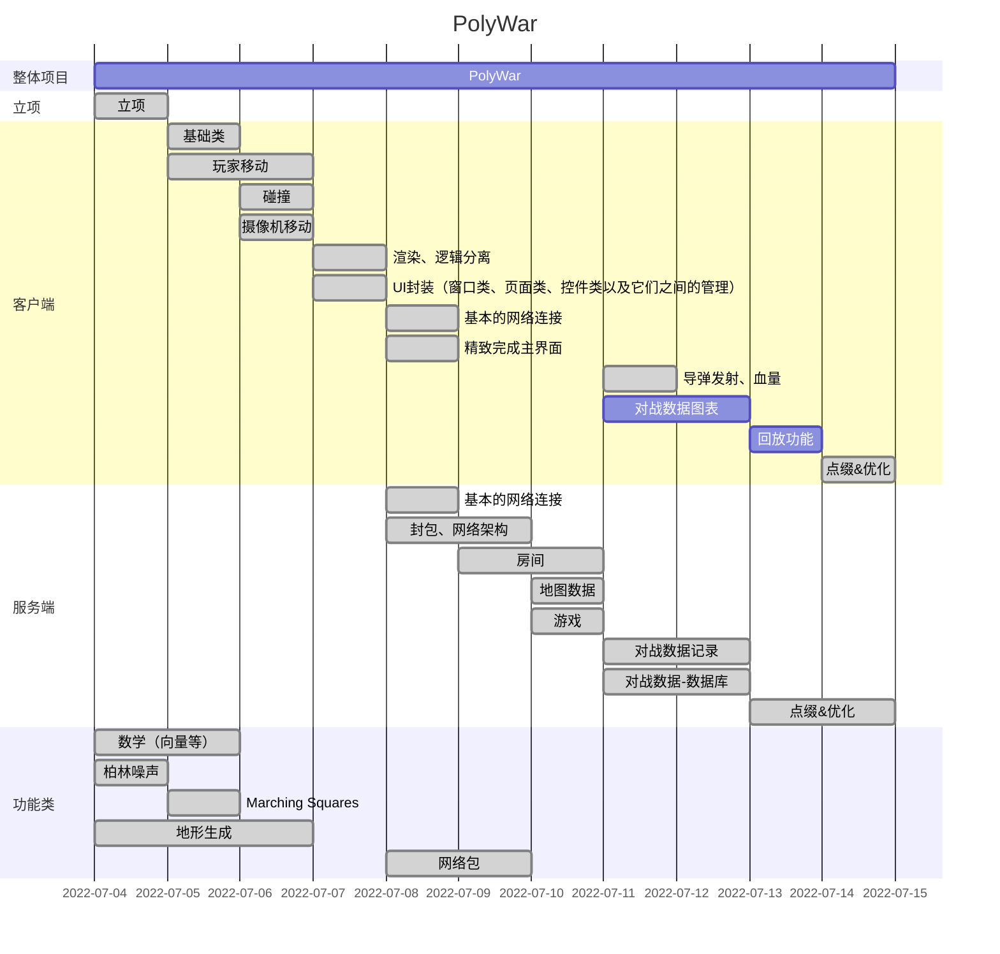

# PolyWar-Draft

## 小学期项目说明（初稿）

> 2022/06/27 11:32
> 陈旭东
> 自选项目，独立完成：
> 采用Java语言，实现一个基于网络、多线程的图形用户界面的游戏。

1. 基本功能：70%
   i. 软件分层结构（分包组织，不同层的类定义在不同的包中） 5分
   ii. 代码规范性 5分
   iii. 程序基本功能（含代码检查）60分
   （1） 采用技术：GUI, Exception, Thread, network, I/O stream, Collection
   （2） 功能演示 （卡死/闪退/重启:扣5）
   （3） GUI（含菜单）
   （4） 多线程+网络交互
   （5） 数据存储：文件或数据库

2. 扩展功能：30%
   单项10分，含代码检查。基本功能扣分可以从扩展功能补。
   i. 完整的工具栏+状态栏，各5分
   ii. 统计图
   iii. 使用数据库存储相关信息
   iv. 视频 / 合理音频和音效
   v. 文档处理，如PDF、Excel、Word等
   vi. Android/鸿蒙/iOS App
   vii. 其它（认定标准：功能实用+有一定代码量支撑）

3. 交付物要求
   a) 开题报告（项目描述、功能点、总体技术方案）
   b) 日报，按天提交
   c) 结题报告（需求、设计：技术方案、实现：类图、用户手册、项目总结）
   d) 源代码、可运行程序环境（含必要的资源文件）、运行录屏（小于50M，过大视频可以用"格式工厂"等相关软件转码后再提交）：验收答辩后提交，未提交会没有答辩成绩。

---

## PolyWar

类似坦克大战的 C/S 模式多人联机对战游戏。

### 一、游戏流程：

创建房间，加入房间，房主开始游戏。

玩家初始随机生成在地图中，地图中存在障碍物、随时间随机刷新的道具、可利用的机关，玩家可以移动、发射子弹，玩家中弹时降低血量，血量降低为0时玩家死亡，一定时间后开始缩圈，在圈外的玩家会受到持续伤害，最后存活的玩家获胜。

### 二、功能点：

#### 基本功能（70pts）

- 功能完成（15pts）✅

  卡死/闪退/重启：-5pts

- GUI（15pts）✅

  含菜单，可以是游戏菜单

- 网络对战（15pts）✅

  多线程 + 网络实时交互

  无实时对战（10pts）

  仅采用点对点的模式（10pts）

- 数据保存（15pts）✅

  文件或数据库

- 代码规范（5pts）✅

- 代码架构（5pts）✅

#### 扩展功能（30pts）

- 部署在云端（5pts）✅
- 多组同时网络对战✅
- 统计图
- 数据库✅
- 音频（5pts）+音效（5pts）/视频✅
- Excel/Word/PDF
- Android/HarmonyOS/IOS 的开发
- 其他，与游戏功能相关，且有一定代码量支撑

- 功能点的代码抽查，无法解释扣5.

### 三、开发计划

